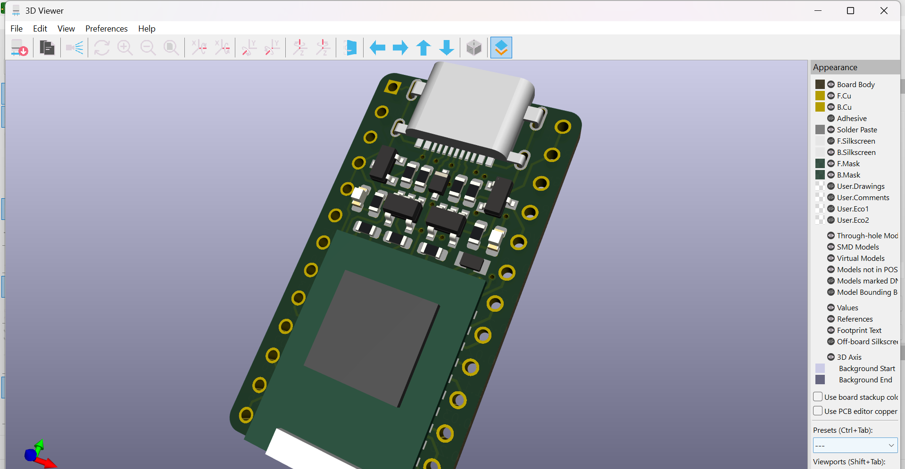
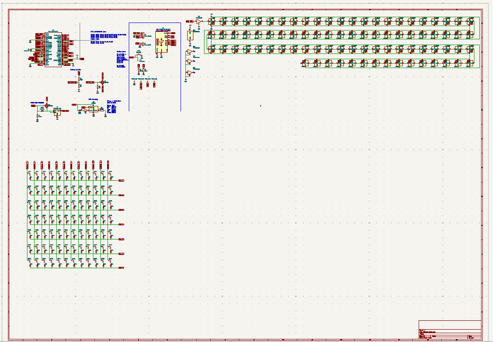

# July 21: Researching for the ultimate keyboard

So i did some researching and basically what i want from this keyboard is a couple of things.

- has to be wireless
- needs to have multiple device connectivity and instant switching between them
- needs to have a good battery life
- hot swappable keys
- indiviidualy addressable RGB lghting

First thing that i want to do is decide the microcontroller for it supported by ZMK. ZMK could support basically any mcrocontroller that has the supporte microchip set but they recommended using some open source microcontrollers that are supported by the community. I took a look at some and decided why use a prebuilt microcontroller and why not just use the opensource microcontroller's schematics and put em on my keyboard and we would have ample PCB space because a keyboard is pretty big so why not just expand the microcontroller on the keyboard itself, what i am saying is use the microcontroller's schematics and put it on the keyboard's PCB and route it myself and place the components where ever i want to.

the microcontroller i choosed is [this](https://github.com/joric/nrfmicro):

ok so started working on it, i would have a 84 keys keyboard. i first made the switch matrix closer to the actual shape of the keyboard layout but then somehow though we might not enough pins so ended up reverting it to this(but turns out we have more then enough pins, 28 to be precise)

Lapse session: https://lapse.hackclub.com/timelapse/6FpUl1i0e8Nd

---

# Next day: Footprints, 3D Models & Schematics

i finished the schematics, and found and imported all the footrpints and their 3d models and placed them on the PCB exactly where i wanted them to be.

Lapse link:
https://lapse.hackclub.com/timelapse/ch_FO-Pfzgz0

---

# Next day: PCB Routing

i started routing the PCB, and it was a bit of a challenge because i had to route the microcontroller's pins to the switch matrix and also to the other components like the battery, charging circuit, and RGB lighting. But after a few hours of routing, i managed to get everything connected properly.

| Top PCB Routing | Bottom PCB Routing |
|:---:|:---:|
|  |  |

Lapse link:
https://lapse.hackclub.com/timelapse/OkOtTtODVTxe

---

# Next day: Mounting Holes & Bootloader Circuitry

added mounting holes, remaining stuff added related to bootloader and frmware flashing
i added circuitry for the bootloading thing and added a button for it

Lapse link:
https://lapse.hackclub.com/timelapse/6yTGAWsrufwA

---

# Next day: Case Modeling & Optimization

tried to start making a case
file was apparently too big and had to do a lot of isolations and optimization to keep it from crashing on my 4 gb ipad
so i just thought i show here what's that was made and make the case a separate project.

Lapse link:
https://lapse.hackclub.com/timelapse/ksh1qt40XOUj
